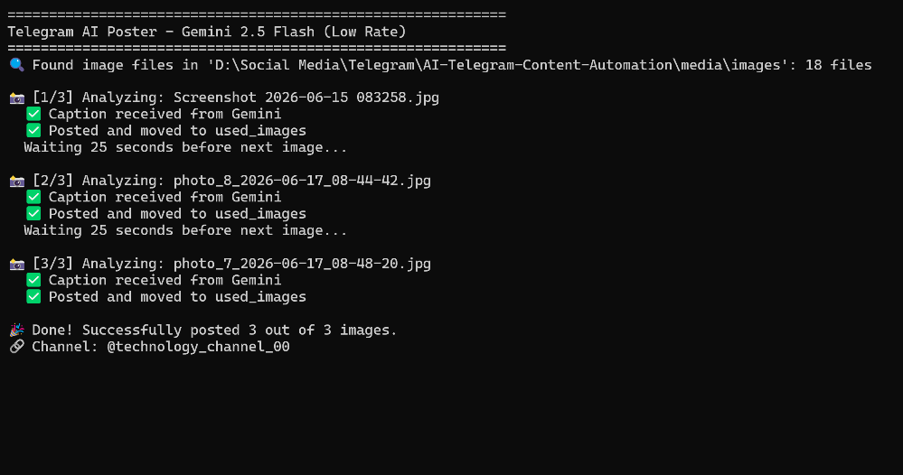
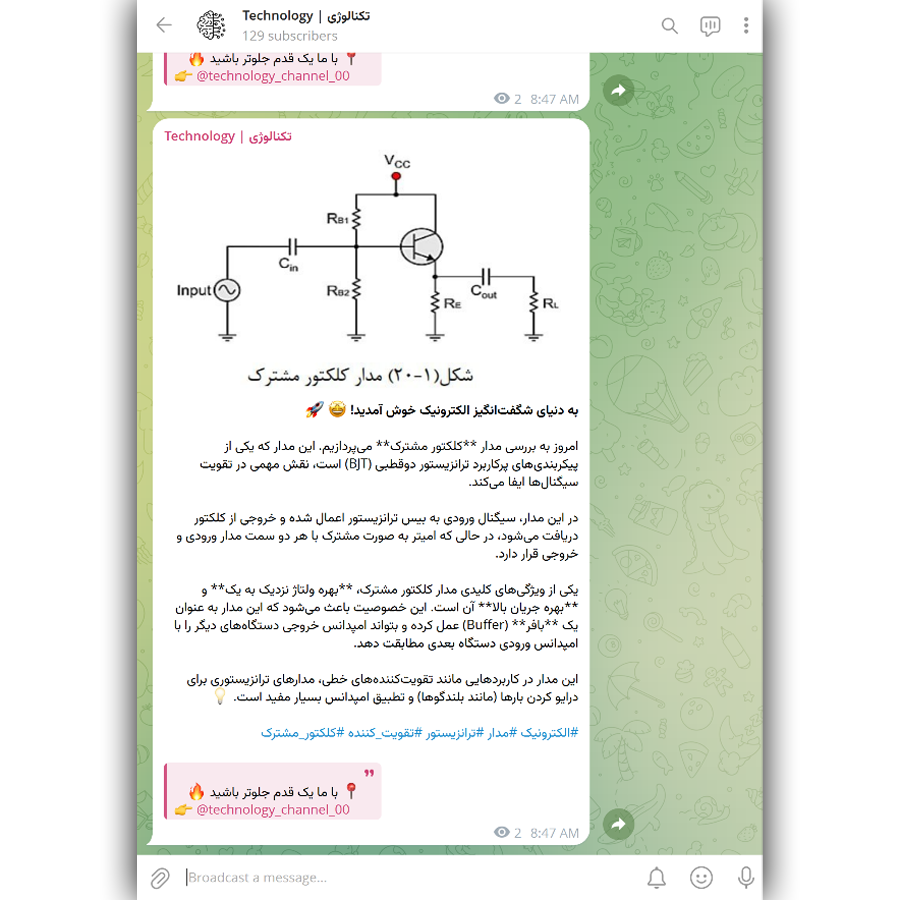
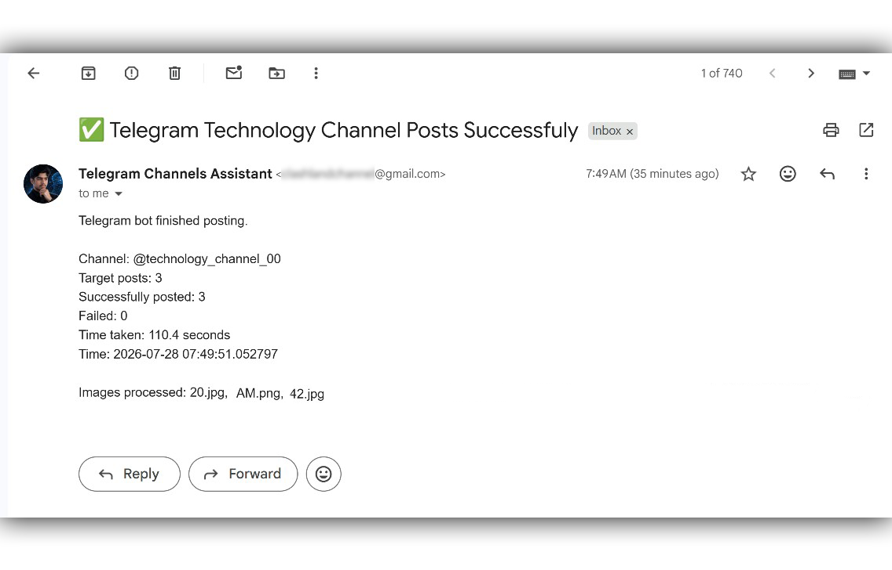

# AI-Powered-Content-Automation

An AI-powered automation system that analyzes images, generates intelligent captions, and publishes content automatically to Telegram channels.

---

## Overview

Managing content for Telegram channels requires time for selecting media, writing captions, formatting posts, and publishing consistently.

This project automates the complete content workflow by combining Artificial Intelligence, image analysis, and Telegram automation.

The system can be adapted for technology channels, educational platforms, news communities, and other content-driven platforms.

---

## Features

- 🤖 AI-powered image analysis and caption generation
- 🖼️ Automatic image processing workflow
- ✍️ Intelligent content generation using AI
- 📢 Automated Telegram channel publishing
- 📁 Automatic media organization
- 🔄 Retry and error handling system
- 📧 Email execution reports
- ⚙️ Configurable automation workflow

---

## How It Works

The automation workflow follows these steps:

```text
Images Folder
      |
      v
Select Images
      |
      v
AI Image Analysis
      |
      v
Generate Caption
      |
      v
Format Content
      |
      v
Publish to Telegram
      |
      v
Move Processed Files
      |
      v
Send Execution Report
```

---

## Use Cases

This automation system can be used for:

- Technology channels
- Educational communities
- News and information channels
- Product content automation
- AI-assisted social media workflows
- Automated publishing systems

---

## Technologies

- Python
- AI API Integration
- Gemini API
- Telegram Bot API
- SMTP Email Service
- Pillow
- Requests

---

## Project Structure

```text
AI-Powered-Content-Automation/

├── main.py
├── requirements.txt
├── .env.example
├── .gitignore
├── README.md

├── assets/
│   ├── channel_logo.png
│   └── group_logo.jpg

├── media/
│   ├── images/
│   └── used_images/

├── screenshots/
│   ├── console_execution.png
│   ├── telegram_result.png
│   └── email_report.png

└── docs/
    └── workflow.md
```

---

## Installation & Setup

### 1. Clone Repository

```bash
git clone https://github.com/unesjami/AI-Powered-Content-Automation.git
```

### 2. Install Dependencies

```bash
pip install -r requirements.txt
```

### 3. Configure Environment Variables

Create a `.env` file based on `.env.example` and add your own credentials:

```env
GEMINI_API_KEY=your_api_key_here

TELEGRAM_BOT_TOKEN=your_bot_token_here

CHANNEL_ID=your_channel_id

EMAIL_ADDRESS=your_email

EMAIL_PASSWORD=your_password
```

### 4. Run Application

```bash
python main.py
```

---

## Screenshots

### Console Execution



### Telegram Result



### Email Report



---

## Security

Sensitive information such as:

- API keys
- Telegram bot tokens
- Email credentials

must always be stored in environment variables and never uploaded to public repositories.

---

## Documentation

Additional project documentation:

```
docs/
└── workflow.md
```

The workflow document explains the system process and automation logic.

---

## License

This project is licensed under the MIT License.

---

## Author

Created as an AI automation engineering project demonstrating:

- API integration
- AI workflow automation
- Python development
- Real-world problem solving
- Software engineering practices
```