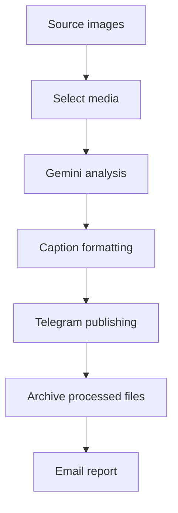

# AI-Powered Content Automation

<p align="center">
  <strong>An AI-assisted workflow that turns images into formatted Telegram channel posts.</strong>
</p>

<p align="center">
  
  
  
  <a href="LICENSE"></a>
</p>

## Overview

This project automates a practical content-publishing workflow: analyze source images, generate captions with Gemini, format a Telegram post, publish it to a channel, organize processed media, and send an execution report.

## Workflow



## Features

- AI image analysis and caption generation
- Automated Telegram channel publishing
- Consistent caption formatting
- Media selection and processed-file organization
- Retry and error handling
- Email execution reports
- Environment-based configuration

## Technology

- Python
- Gemini API
- Telegram Bot API
- SMTP
- Pillow
- Requests

## Repository structure

```text
├── main.py
├── requirements.txt
├── .env.example
├── docs/workflow.md
└── screenshots/
    ├── console_execution.png
    ├── telegram_result.png
    └── email_report.png
```

Runtime media directories are created or supplied locally and are intentionally excluded from version control.

## Setup

```bash
git clone https://github.com/unesjami/AI-Powered-Content-Automation.git
cd AI-Powered-Content-Automation
python -m venv .venv
pip install -r requirements.txt
cp .env.example .env
python main.py
```

On Windows, copy `.env.example` to `.env` manually before running the application.

## Configuration

| Variable | Purpose |
|---|---|
| `GEMINI_API_KEY` | Gemini API credential |
| `TELEGRAM_BOT_TOKEN` | Telegram bot token |
| `CHANNEL_ID` | Destination channel identifier |
| `EMAIL_ADDRESS` | Sender address for reports |
| `EMAIL_PASSWORD` | Email app password or credential |

Never commit the populated `.env` file.

## Results

### Telegram output


### Execution report


## Documentation

See [docs/workflow.md](docs/workflow.md) for the detailed workflow.

## Operational notes

- API quotas and Telegram limits depend on the accounts and services used.
- Keep only one scheduled instance active if duplicate posts must be avoided.
- Test with a private channel before using a production destination.

## License

Released under the [MIT License](LICENSE).

## Author

Created by [Unes Jami](https://github.com/unesjami).
